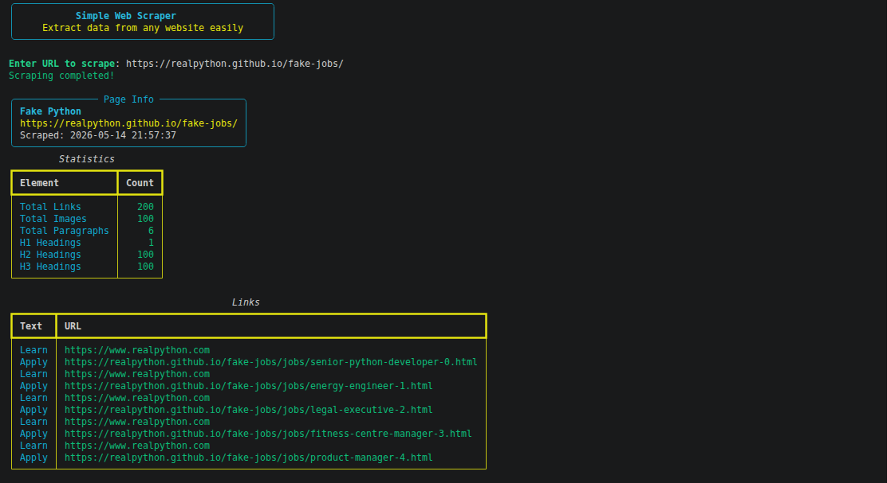
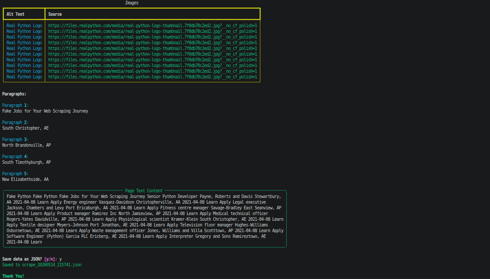

# Python Web Scraper

## Features

- Scrape webpage title, links, images, paragraphs, and text content
- CLI interface with colored output
- Automatic HTTPS prefix addition
- JSON export functionality
- Statistics overview of extracted content

---

## Installation

1. Clone the repository:
```bash
git clone https://github.com/tazbikislam/Python-Web-Scraper
```

2. Install dependencies:

```bash
pip install requests
pip install beautifulsoup4
pip install rich
```

---

## Usage

Run the scraper:

```bash
python scraper.py

Enter any website URL when prompted. The scraper will:

- Fetch the webpage
- Extract and display all content
- Offer to save results as JSON
```

---

## Application User Interface

<p>
  
</p>
<p>
  
</p>

---

## License

This project is licensed under the MIT License [LICENSE](https://github.com/tazbikislam/Python-Web-Scraper/blob/main/LICENSE) <br>
**Free for personal and commercial use.**

---

## Contact

- **Email**: [tazbikislam.work@gmail.com](mailto:tazbikislam.work@gmail.com)
